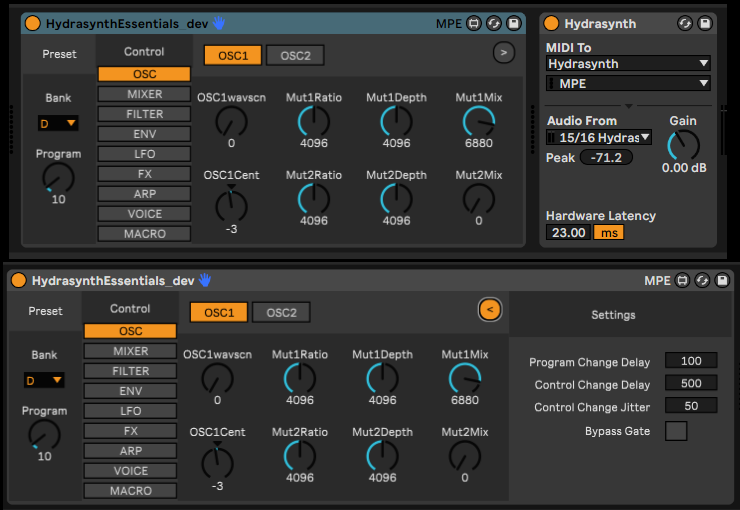

# HydrasynthEssentials

## This project is archived and no longer actively developed
After much effort, I've come to the conclusion that the concept of M4L-based controllers for hardware synths is fatally flawed. Moreover, I've ditched Ableton for Bitwig, so I'm basically done with Max4Live. If you think you can make this work, have at it. I've given up.

## Overview
HydrasynthEssentials (HSE for short) is a Max4Live controller for the essential functions of the ASM Hydrasynth.  It allows bidirectional control of the critical parameters, with the primary goal of making them available for automation/modulation in Ableton Live.

What qualifies as an 'essential' function? Well, I've basically gone with the collection of controls that ASM themselves selected to be controlled via MIDI CC rather than NRPN (although note that the device uses NRPNs and not CCs); so as a general rule, if the MIDI implementation charts show that a parameter on the synth is controllable via MIDI CC, then it is available in HydrasynthEssentials. There are a few deviations from this rule, but not many (I left out OSC1 Cent and added a Reverb param or two, for example).

The intended workflow is that the Hydrasynth hardware will store the core sound via a preset saved in one of its 5 banks and the M4L device will act as an 'override' for any supported parameter.  The expectation is that the exploration of the sound will be driven by the hardware using the Hydrasynth's excellent user interface; the software will respond to the incoming MIDI data and set the controls accordingly.  By default, the software controls do not affect the hardware until their values are first set by incoming MIDI; the reason for this is that it prevents the default values of the software controls from being sent to the hardware and messing up presets. See the Basic Usage section below.

## Requirements
Minimum Versions:
- Ableton Live Suite: 11.0
- Max: 8.1.10
  - *NOTE*: I use the full standalone Max runtime rather than the one that comes bundled with Live. I have tested the device using the bundled runtime and it appears to work normally, but I'm not 100% certain that there are no dependencies on full Max
- ASM Hydrasynth desktop or keyboard running firmware 1.5.2 or later
  - *NOTE*: I've only got the desktop version, so no keyboard-only features are currently supported (as I'd have no way to test them)

## Installation
1. Download the latest released version
1. Copy the `HydrasynthEssentials.amxd` file into the 'Max MIDI Effect' area of your user library
  - Default locations
    - Windows: `C:\Users\[username]\Documents\Ableton\User Library\Presets\MIDI Effects\Max MIDI Effect`
    - Mac: `Macintosh HD/Users/[username]/Music/Ableton/User Library/Presets/MIDI Effects/Max MIDI Effect`

## Basic Usage
- Drag the device from your user library onto a MIDI track
  - I use an External Instrument device after HSE to handle audio and MIDI I/O for the Hydrasynth
- When first placed on the track, none of the on-screen controls will have an effect on the Hydrasynth hardware
  - This is by design
  - The intention was to prevent any of the software controls from affecting the hardware until the value has been set by incoming MIDI data
- Load a preset on the hardware
  - The software will respond and update its corresponding Bank and Program controls
- Start changing parameters on the hardware
  - When a supported parameter is changed on the hardware, the software updates
- If you save and reload the Live Set at this point, you should see that the device sets the hardware to the same preset and applies whatever other changes have been saved for supported parameters
- You can automate any of the controls on the device just like you would any other device or plugin in Ableton Live
  - note that automation will only take effect if the control to be automated has previously had its value set via incoming MIDI data at least once

## Settings
- There is a 'Settings' section that is hidden by default
- Click the (>) button toward the top right
- Here you can modify some basic configuration settings
  - Program Change Delay
    - When you load a saved Live Set, HSE will send out a program change MIDI message to put the hardware into the proper state
    - this determines the time (in milliseconds) to wait after the device is loaded before sending out that program change message
  - Control Change Delay
    - After the program change message has been sent, HSE will send out a NRPN message for every control on the device to update the hardware (only those controls that have been previously set by incoming MIDI are sent out to avoid default values from destroying presets on the hardware)
    - This sets the time (in milliseconds) to wait before sending the NRPN messages
  - Control Change Jitter
    - Adds a random amount of delay for each NRPN message to avoid 'overloading' the MIDI system
  - Bypass Gate
    - When enabled, this bypasses the 'MIDI gating' system described previously which prevents software controls from affecting the hardware until set by incoming MIDI

## Using the Development Version

If you want to work directly with the development version of the device, follow the steps below:
- Clone the repo into a folder on your [Max Search Path](https://docs.cycling74.com/max8/vignettes/search_path)
- Drag the `HydrasynthEssentials_dev.amxd` file directly onto a MIDI track in Live
  - don't copy it into your user library in this case
